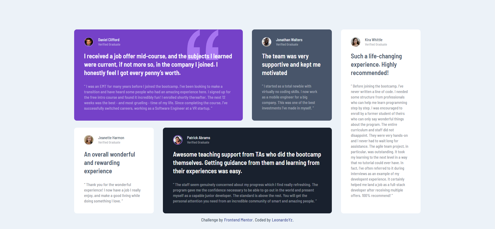

# Frontend Mentor - Testimonials grid section solution

This is a solution to the [Testimonials grid section challenge on Frontend Mentor](https://www.frontendmentor.io/challenges/testimonials-grid-section-Nnw6J7Un7). Frontend Mentor challenges help you improve your coding skills by building realistic projects.

#

## Overview

### The challenge

Users should be able to:

- View the optimal layout for the site depending on their device's screen size

#

### Desktop

### Mobile

#

### Links

- Solution URL: [Solution](https://www.frontendmentor.io/solutions/mobile-first-testimonials-grid-section-css-grid-Utg_iXDpJ)
- Demo URL: [Demo](https://leonardoyz.github.io/testimonials-grid-section/)

## My process

### Built with

- Semantic HTML5 markup
- CSS custom properties
- CSS Grid
- Mobile-first workflow

#

## Author

- Frontend Mentor - [LeonardoYz](https://www.frontendmentor.io/profile/LeonardoYz)
